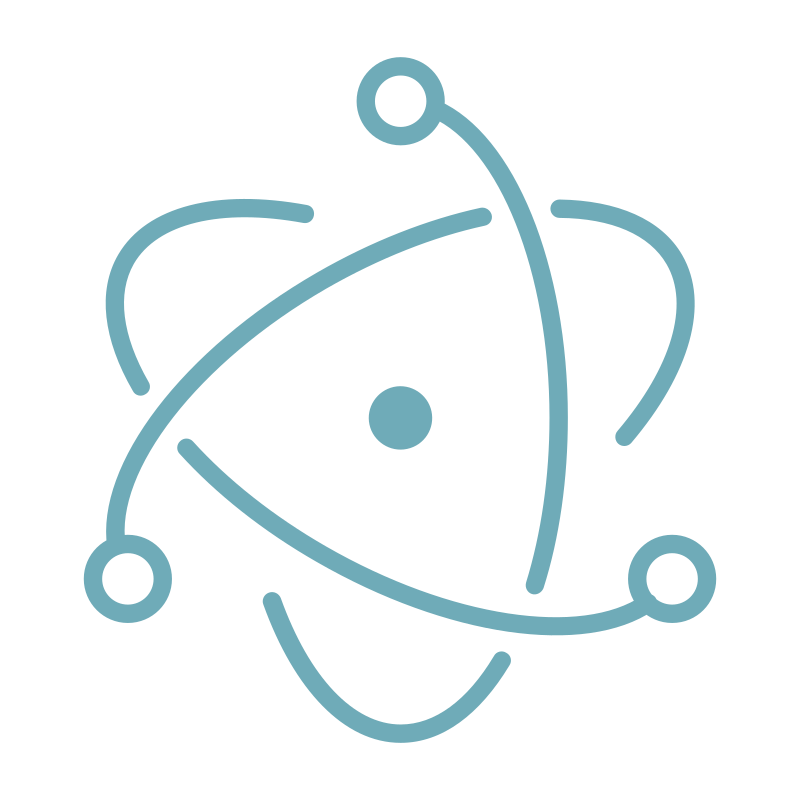
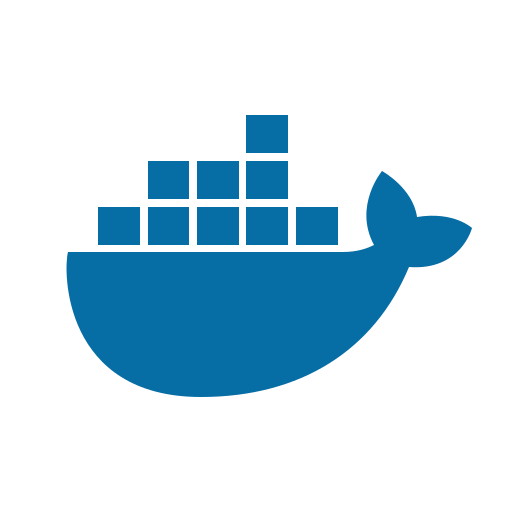
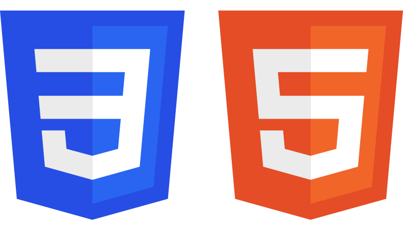

### Hi there, I'm Frayna 👋

### Skillset :

| Front-end : | Back-end : | ORM/Database : | Others : |
|-----------------------------------------------------------------------------------------|-------------------------------------------------------------------------------------------|---|---|
| React   | Spring   | Prisma     | Electron |
| Vue     | NestJS   | Hibernate  | Docker |
| Svelte					      | Fastify | MySQL      | Bash |
| Scss     |ex Express | MongoDB    | Nginx |
| HTML/CSS | NodeJS   | PostgreSQL | Git |
| Tailwind | Flask	  |___ Mongoose | GH Actions |

<!-- 💻 Nodejs -->
### Streaming :

|  LiveStream : |
|----------------------------------------------------------------------------------------------------------------------------|
|                                                  |
|  |

### Interesting repositories :

 

<!--
**Frayna/Frayna** is a ✨ _special_ ✨ repository because its `README.md` (this file) appears on your GitHub profile.

Here are some ideas to get you started:

- 🔭 I’m currently working on ...
- 🌱 I’m currently learning ...
- 👯 I’m looking to collaborate on ...
- 🤔 I’m looking for help with ...
- 💬 Ask me about ...
- 📫 How to reach me: ...
- 😄 Pronouns: ...
- ⚡ Fun fact: ...
-->
